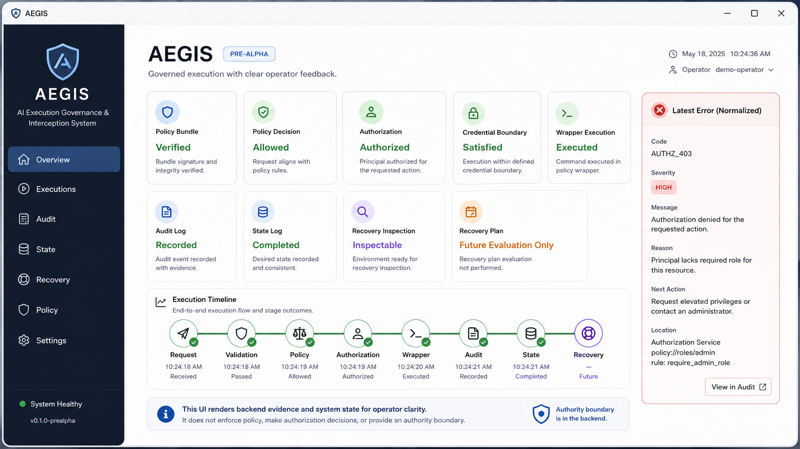

<div align="center">

# AEGIS

**AI Execution Governance & Interception System**

[](https://www.rust-lang.org/)
[](https://www.gnu.org/software/bash/)
[](https://www.typescriptlang.org/)
[](https://www.python.org/)
[](https://github.com/features/actions)
[](LICENSE)



</div>

## Why?

AI systems are beginning to do more than answer questions. They can ask to send messages, change records, write files, open tickets, deploy software, and call business tools.

That kind of execution deserves governance.

Capability without a clear execution boundary creates unnecessary risk. AEGIS exists to place a deterministic governance layer between AI decisions and the actions those systems want to perform.

## What?

AEGIS is a Rust execution governance gateway for AI-driven actions with a desktop operator surface and local gateway.

It validates requests, verifies policy, authorizes execution, checks credential boundaries, dispatches governed wrappers, records audit evidence, and fails closed when it cannot prove an action is safe to continue.

**Latest published release:** [`v0.4.1` Developer Preview](https://github.com/irgordon/aegis/releases/tag/v0.4.1). It provides unsigned, not-notarized, archive-based macOS downloads with `SHA256SUMS` verification.

The immutable `v0.4.1` artifacts predate the current first-run refresh. They do not include the later bundled `health.check` request fixture, conventional `--help` output, or updated desktop release identity.

**Current development target:** `v0.4.2 Developer Preview Refresh`. The current development branch contains those unreleased first-run improvements. They are not part of the latest published release until `v0.4.2` is validated and published.

AEGIS remains a prerelease. Do not deploy it to protect production systems or treat it as enterprise-hardened.

For release-accurate download, checksum, extraction, and launch notes, start with the [wiki overview](docs/wiki/01-overview.md).

## How?

AEGIS follows a controlled execution path:

```text
AI Request
  |
  v
Validation
  |
  v
Verified Policy Bundle
  |
  v
Policy Evaluation
  |
  v
Execution Authorization
  |
  v
Credential Boundary
  |
  v
Wrapper Dispatch
  |
  v
Wrapper Execution
  |
  v
Audit Evidence
  |
  v
Execution Lifecycle
```

## What If?

What if AI execution became deterministic, auditable, and governed instead of trusted implicitly?

AEGIS is built around that question. It treats execution as something that should be requested, checked, bounded, recorded, and explainable.

For architecture, implementation details, and project documentation, see [docs/](docs/).
