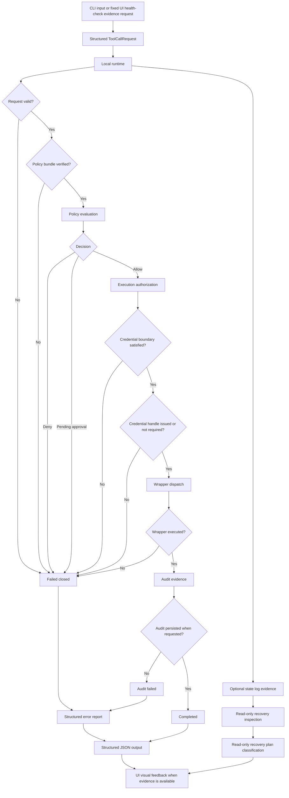

# AEGIS
# Execution Flow

## What Is This?

This page explains how a request moves through the current local AEGIS runtime.

The main idea is simple: a request must pass through every governance boundary before execution can happen.

## Signal Flow

The current operator signal flow is:

```text
CLI request path or fixed Tauri UI evidence path
  -> structured request
  -> request validation
  -> runtime local path
  -> policy bundle verification
  -> policy decision
  -> execution authorization
  -> credential boundary
  -> local credential injection boundary when required
  -> wrapper dispatch
  -> wrapper execution
  -> audit record
  -> state transition log
  -> structured JSON output
  -> UI visual feedback
```

The CLI exists for local execution, validation, inspection, testing, and automation.

The Tauri UI can now render fixture-backed evidence and fixed live `health.check` backend evidence. It does not submit arbitrary gateway requests, run mutation wrappers, inspect live state logs, or generate live recovery plans.

## Flow Diagram



## Successful Execution

A successful local execution follows this pattern:

```text
Created
  -> Validated
  -> BundleVerified
  -> PolicyEvaluated
  -> Authorized
  -> Dispatching
  -> Executed
  -> Audited
  -> Completed
```

For `health.check`, the wrapper returns a safe local health result.

For `sandbox.note.write`, the wrapper writes only inside a caller-supplied sandbox directory after mutation gates pass.

## Fail-Closed Execution

AEGIS fails closed when it cannot prove execution should continue.

Examples:

- malformed request
- unsupported tool
- invalid policy bundle
- checksum mismatch
- signature verification failure
- denied policy decision
- pending approval decision
- authorization mismatch
- credential boundary failure
- wrapper dispatch failure
- wrapper execution failure

Failing closed means the runtime denies or stops the action instead of guessing.

## Audit-Failed Path

Audit persistence is optional.

When an audit log path is supplied, AEGIS must append the audit record and flush the write. If audit persistence fails after execution, the runtime reports `audit_failed` instead of pretending the request completed normally.

## Recovery Inspection and Planning

Recovery inspection reads local execution state logs.

Recovery planning uses inspection output to classify what a future recovery system may be allowed to consider. It does not replay work, resume execution, or mutate state.

The current planner can classify records into bounded outcomes such as:

- not recoverable because the execution already reached a terminal state
- not recoverable because the state evidence is corrupted
- candidate for future audit retry
- candidate for future replay evaluation
- inspection failed

## UI Output

The Tauri UI should render backend evidence without creating authority.

Current live UI evidence is limited to a fixed read-only `health.check` path. The broader evidence model remains structured so future UI views can render:

- lifecycle timeline
- policy bundle status
- policy decision
- authorization status
- credential boundary and injection status
- wrapper execution status
- audit persistence status
- state log and recovery classifications
- structured error message, reason, next action, and location

The UI must not decide policy, authorize execution, or invent lifecycle state.
